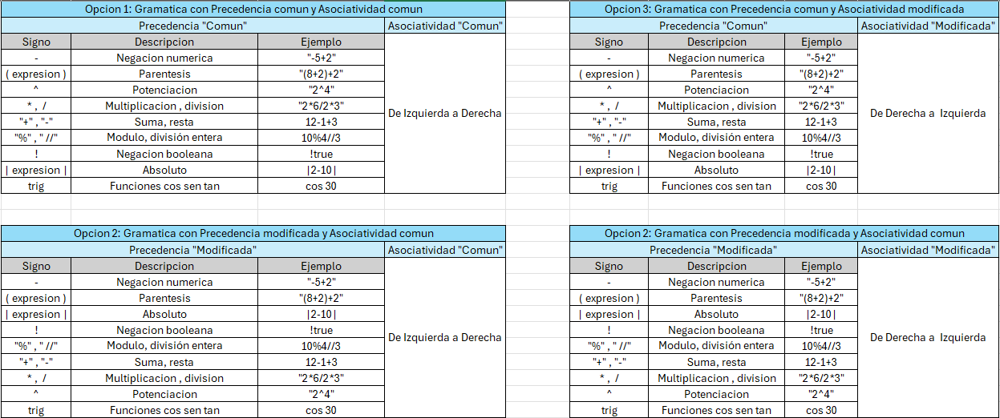
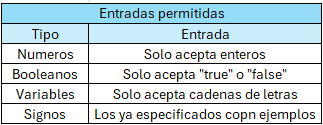

# Modificación de Precedencia y Asociatividad en Gramáticas: Proyecto LENGUAJES DE PROGRAMACIÓN

## Descripción del Proyecto

Este proyecto se enfoca en la modificación de la precedencia y la asociatividad en una gramática específica utilizando herramientas como ANTLR, Flex y Bison. El objetivo principal es crear cuatro variantes de la gramática original, cada una con un conjunto diferente de reglas de precedencia y asociatividad, seguido por la implementación de pruebas para verificar el comportamiento de cada variante.

## Ejecución del Programa en ANTLR
Una vez configurado el entorno de ANTLR, asegúrese de estar en la carpeta "antlr" y abrir la consola. A continuación, ejecute los siguientes comandos, cada uno correspondiente a una variante de la gramática:

1. **Generar código con ANTLR**:
   ```bash
   antlr4 -Dlanguage=Python3 -visitor Calculadora.g4
   antlr4 -Dlanguage=Python3 -visitor CalculadoraPre.g4
   antlr4 -Dlanguage=Python3 -visitor CalculadoraAso.g4
   antlr4 -Dlanguage=Python3 -visitor CalculadoraMod.g4
   
## Pruebas Específicas
Si desea realizar pruebas específicas, puede modificar el archivo "EjemploEntradaCalc.txt". Por defecto, este archivo contiene algunas expresiones básicas de prueba. También puede crear un archivo .txt nuevo con las expresiones que desee probar.

**Para ejecutar el programa, simplemente ejecute el archivo MainCalculadora.py y especifique el archivo .txt con las expresiones a probar. Puede seguir el siguiente ejemplo de estructura**:

```bash
python3 MainCalculadora.py EjemploEntradaCalc.txt
```


## Objetivos

1. **Definir la gramática original**: Establecer una gramática inicial utilizando ANTLR y Flex con Bison para el lenguaje en cuestión.

2. **Generar analizadores léxicos y sintácticos**: Utilizar ANTLR y Flex con Bison para generar los analizadores léxicos y sintácticos necesarios basados en la gramática definida en ANTLR.

3. **Crear variantes de la gramática**: Desarrollar tres variantes adicionales de la gramática original, cada una con cambios específicos en la precedencia y la asociatividad.
   
   - **Prueba 1: Precedencia y asociatividad normales**: Mantendrá la precedencia y la asociatividad estándar del lenguaje.
   
   - **Prueba 2: Precedencia modificada**: Se realizarán ajustes en la precedencia de ciertos operadores para observar cómo afecta el análisis sintáctico.
   
   - **Prueba 3: Asociatividad modificada**: Se modificará la asociatividad de ciertos operadores para evaluar su impacto en la interpretación de expresiones.
   
   - **Prueba 4: Precedencia y asociatividad modificada**: Se combinarán ajustes tanto en la precedencia como en la asociatividad para evaluar su interacción.
## Definicion de gramatica para cada prueba: 

## Entradas permitidas en el programa: 



## Menú de Selección de Gramática
El programa consta de un menú en el que puede seleccionar la gramática específica que desee. Las gramáticas se han definido de acuerdo a las especificaciones detalladas en el documento adjunto.

Nota: Para comprender las entradas válidas (los operadores y especificaciones), consulte la documentación adjunta.

¡Disfrute utilizando la calculadora implementada con ANTLR! Si tiene alguna pregunta o encuentra algún problema, no dude en abrir un issue en este repositorio. ¡Gracias por su interés!
