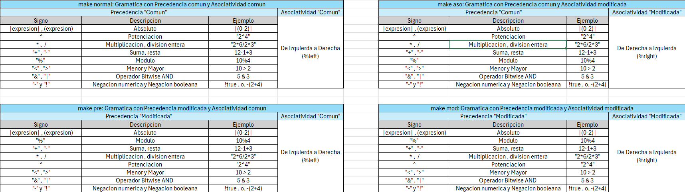

# Modificación de Precedencia y Asociatividad en Gramáticas: Trabajo LENGUAJES DE PROGRAMACIÓN

## Primer Punto ANTLR:
Este repositorio contiene dos carpetas principales, cada una dedicada a un punto específico del trabajo. La carpeta "antlr" alberga cuatro gramáticas de ANTLR, cada una representando una variación de una calculadora básica. Además, incluye los archivos correspondientes necesarios para el funcionamiento del programa.

### Configuración del Entorno
Antes de ejecutar el programa, asegúrese de tener configurado el entorno de ANTLR con el lenguaje objetivo Python.

### Instalación de ANTLR
Para instalar ANTLR, puede seguir las instrucciones en la [documentación oficial](https://www.antlr.org).

### Especificaciones De La Gramatica


### Entradas Permitidas


### Ejecución del Programa Calculadora en ANTLR
Una vez configurado el entorno de ANTLR, asegúrese de estar en la carpeta "antlr" y abrir la consola. A continuación, ejecute los siguientes comandos, cada uno correspondiente a una variante de la gramática:

1. **Generar código con ANTLR**:
   ```bash
   antlr4 -Dlanguage=Python3 -visitor Calculadora.g4
   antlr4 -Dlanguage=Python3 -visitor CalculadoraPre.g4
   antlr4 -Dlanguage=Python3 -visitor CalculadoraAso.g4
   antlr4 -Dlanguage=Python3 -visitor CalculadoraMod.g4
   
### Pruebas Específicas
Si desea realizar pruebas específicas, puede modificar el archivo "EjemploEntradaCalc.txt". Por defecto, este archivo contiene algunas expresiones básicas de prueba. También puede crear un archivo .txt nuevo con las expresiones que desee probar.


**Para ejecutar el programa, simplemente ejecute el archivo MainCalculadora.py y especifique el archivo .txt con las expresiones a probar. Puede seguir el siguiente ejemplo de estructura**:

```bash
python3 MainCalculadora.py EjemploEntradaCalc.txt
```

### Menú de Selección de Gramática
El programa consta de un menú en el que puede seleccionar la gramática específica que desee. Las gramáticas se han definido de acuerdo a las especificaciones detalladas en el documento adjunto.


## Segunda Parte - Ejecución del Segundo Punto

La segunda parte del proyecto se encuentra en la carpeta "bison", que contiene cuatro gramáticas de Bison junto con sus respectivos archivos de Flex. Para ejecutar este punto del proyecto, siga los siguientes pasos:

### Requisitos Previos

Antes de ejecutar el programa, asegúrese de tener instalado make en su entorno para poder utilizar el Makefile proporcionado.

#### Instalación de make

##### Para Linux:

1. Abre la terminal.
2. Ejecuta el siguiente comando para instalar make:

   - Para distribuciones basadas en Debian y Ubuntu (incluyendo Linux Mint):

     ```bash
     sudo apt-get install make
     ```

   - Para distribuciones basadas en Fedora, CentOS y Red Hat:

     ```bash
     sudo yum install make
     ```

##### Para macOS:

1. Abre la terminal.
2. Si aún no lo tienes, instala Homebrew ejecutando el siguiente comando:

   ```bash
   /bin/bash -c "$(curl -fsSL https://raw.githubusercontent.com/Homebrew/install/HEAD/install.sh)"
   ```

3. Luego, ejecuta el siguiente comando para instalar make:

   ```bash
   brew install make
   ```

##### Para Windows:

1. Descarga e instala el paquete de herramientas de GNU para Windows, también conocido como MinGW. Puedes descargarlo desde el siguiente enlace: [MinGW](https://sourceforge.net/projects/mingw/)
2. Durante la instalación, asegúrate de seleccionar la opción para instalar mingw32-make.

### Especificaciones De La Gramatica


### Entradas Permitidas


### Ejecución del Programa

1. Asegúrese de estar en la carpeta "bison".
2. Puede editar el archivo "EjemploEntradasCalc" para especificar las entradas deseadas o agregar un archivo .txt nuevo con esas entradas en líneas diferentes.
4. Para ejecutar el programa, en la consola, ejecute el siguiente comando correspondiente a la gramática que desea probar y al archivo .txt a probar:
   ```bash
   Para la gramática con asociatividad común y precedencia común.
   - ./normal < EjemploEntradasCalc.txt
   Para la gramática con asociatividad común y precedencia modificada.
   - ./pre < EjemploEntradasCalc.txt
    Para la gramática con asociatividad modificada y precedencia común.
   - ./aso < EjemploEntradasCalc.txt
   Para la gramática con asociatividad modificada y precedencia modificada.
   - ./mod < EjemploEntradasCalc.txt
   ```

**En caso de que no ingrese un .txt, el programa recibira un input del usuario**
### Salida del Programa

El programa mostrará todas las expresiones de salida correspondientes a las entradas proporcionadas, según la gramática seleccionada.


## Descripción del Trabajo

Este proyecto se enfoca en la modificación de la precedencia y la asociatividad en una gramática específica utilizando herramientas como ANTLR, Flex y Bison. El objetivo principal es crear cuatro variantes de la gramática original, cada una con un conjunto diferente de reglas de precedencia y asociatividad, seguido por la implementación de pruebas para verificar el comportamiento de cada variante.

## Objetivos

1. **Definir la gramática original**: Establecer una gramática inicial utilizando ANTLR y Flex con Bison para el lenguaje en cuestión.

2. **Generar analizadores léxicos y sintácticos**: Utilizar ANTLR y Flex con Bison para generar los analizadores léxicos y sintácticos necesarios basados en la gramática definida en ANTLR.

3. **Crear variantes de la gramática**: Desarrollar tres variantes adicionales de la gramática original, cada una con cambios específicos en la precedencia y la asociatividad.
   
   - **Prueba 1: Precedencia y asociatividad normales**: Mantendrá la precedencia y la asociatividad estándar del lenguaje.
   
   - **Prueba 2: Precedencia modificada**: Se realizarán ajustes en la precedencia de ciertos operadores para observar cómo afecta el análisis sintáctico.
   
   - **Prueba 3: Asociatividad modificada**: Se modificará la asociatividad de ciertos operadores para evaluar su impacto en la interpretación de expresiones.
   
   - **Prueba 4: Precedencia y asociatividad modificada**: Se combinarán ajustes tanto en la precedencia como en la asociatividad para evaluar su interacción.
